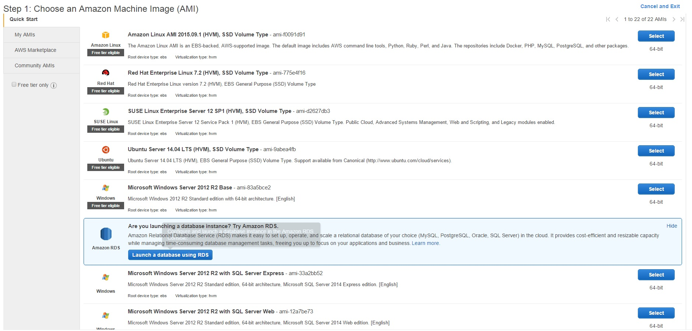
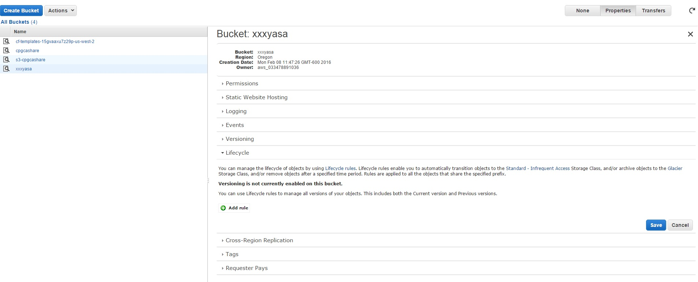
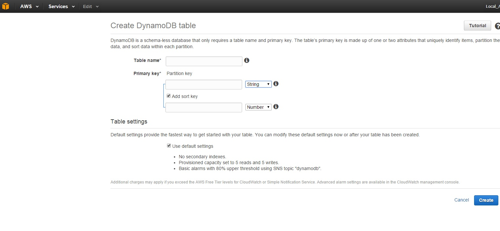
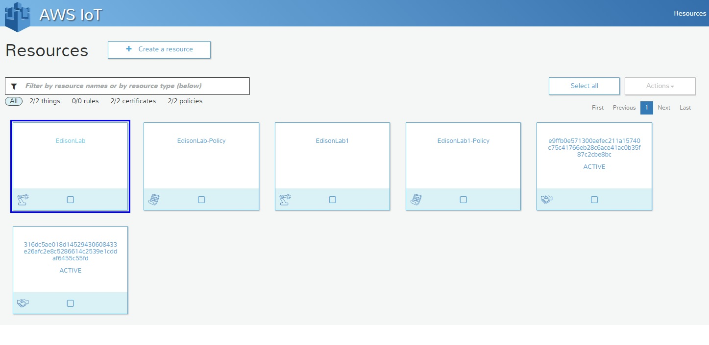
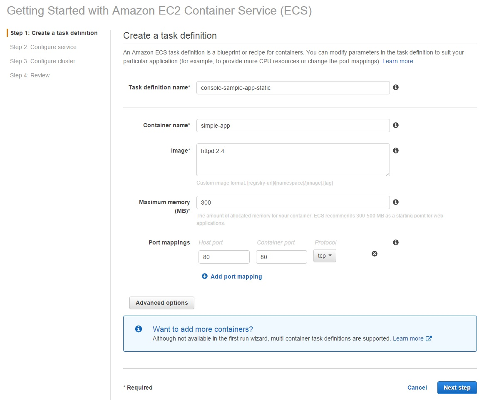
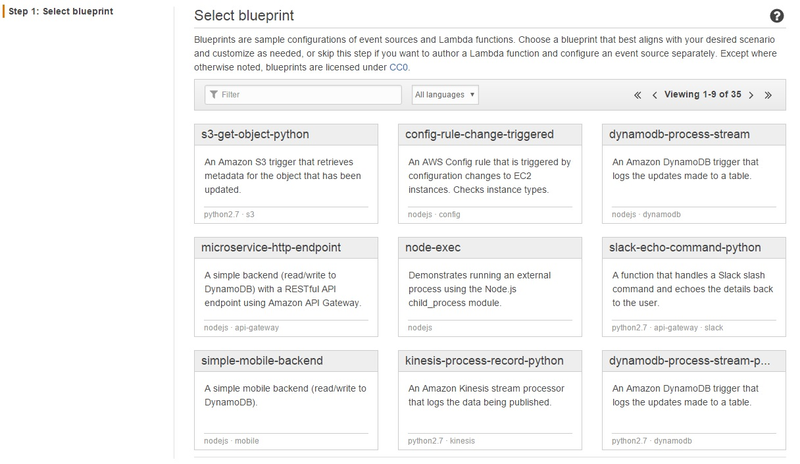
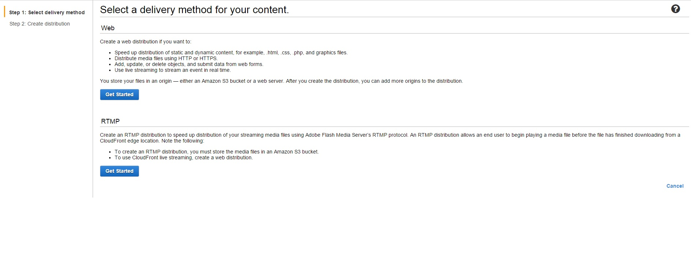
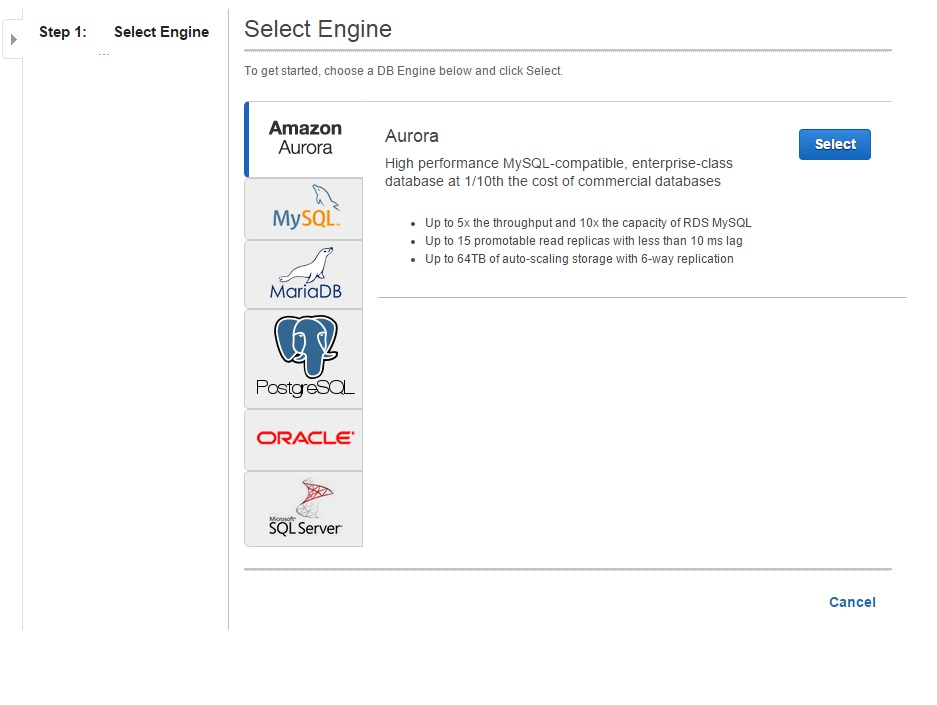
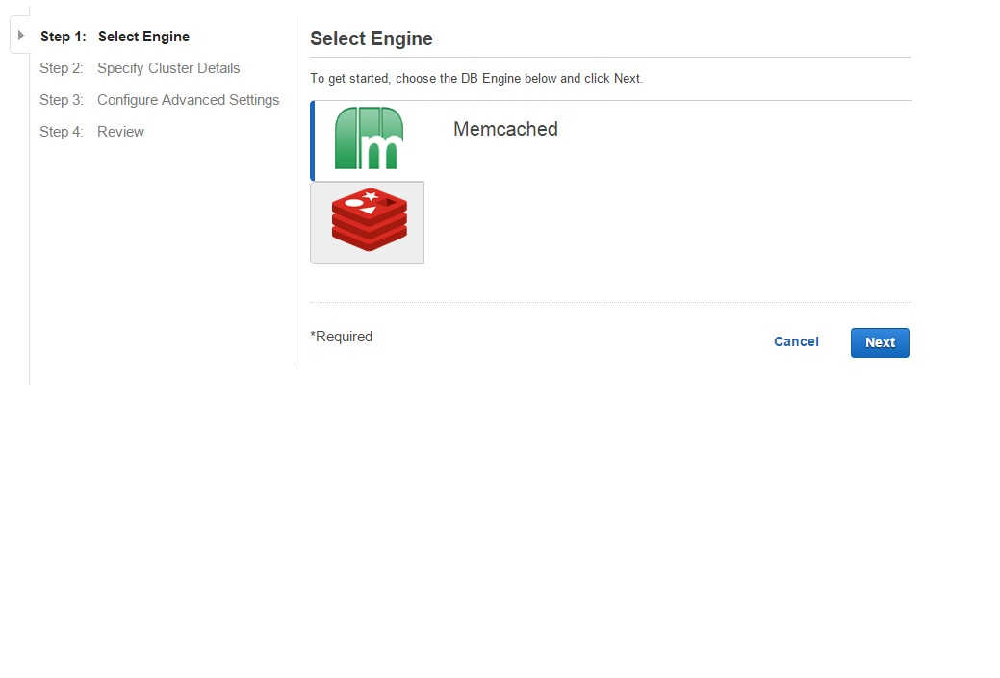

Amazon Web Services IoT
==

**AWS IoT (Amazon Web Services Internet of Things) ** is the cloud platform that help us to connect **IoT (Internet of Things)** devices, to the Amazon Cloud, faster, securely and also provides an elastic solution for the customer, but what is amazon web services?

Amazon Web Services (AWS) was created to expose the Amazon Cloud Services to every customer that need this service(s). The Services that AWS provides are:

* Amazon EC2 - Amazon Elastic Compute Cloud can help you to obtain and boot new service instances, you can create a new Virtual Machine in seconds scale up and down in resources instantly.

* Amazon S3 - Amazon Simple Storage Service is a service designed to store any amount of data, this includes different uses cases for example how often do you need to access your data ? Frequently, Standard or Infrequent ?
 

* Amazon DynamoDB offer a NoSQL Database, you can use this service to collect information in a consistent way and with millisecond latency.

 

* AWS IoT - AWS Internet of Things, This module will help us to connect our IoT devices with the AWS infrastructure and use the information that our devices send in any manner this means, we can process the data, stored the data, create a flow based on conditions that we see on the data , store the data and apply machine learning algorithms and big data analysis.

* Amazon EC2 Container Registry - On this module you can create Docker Containers an linked this container to a service using teh Amazon EC2 service.

* AWS Lambda, this service help us to execute our code without provisioning or managing servers, your code will be executed in the Lamda service, all the pipes behind will be transparent for you.

* Elastic Load Balancing, the service will help to the Amazon customers to distribute the traffic across multiple EC2 instances (Servers running a web application, for example)

* Amazon CloudFront will help us to distribute content to our end users via Web or using RTMP.

* Amazon Elastic Block Storage, Amazon EBS gives us the capability that provides persistent storage volumes that you can use with EC2, this storage is replicated to provide High Availability.

* Amazon RDS -Amazon Relational Database Service offer different engines for the most used relational databases like Amazon Aurora,SQL Server, Oracle, PostgreSQL, MySQL and MariaDB.

* Amazon ElastiCache offer a web service that scale an in memory cache in the cloud. ElastiCache supports two open-source in-memory caching engines Memcached or Redis

* Amazon Redshift is a fast, petabyte-scale data warehouse that makes it simple and cost-effective to analyze all your data using your existing business intelligence tools.

* AWS Data Pipeline
* Amazon Elasticsearch Service
* Amazon Cognito
* AWS Device Farm
* Amazon Mobile Analytics
* Amazon SNS
* AWS CodeCommit
* AWS CodePipeline
* AWS Key Management Service 
* Amazon CloudWatch
* AWS Trusted Advisor
* Amazon API Gateway
* Amazon AppStream
* Amazon Elastic Transcoder
* Amazon SES
* Amazon SQS
* Amazon SWF