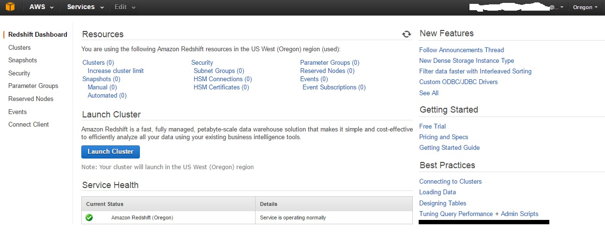
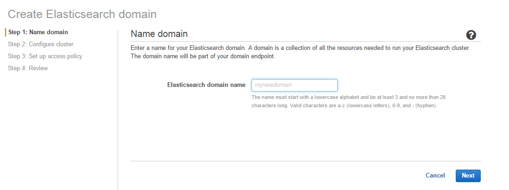
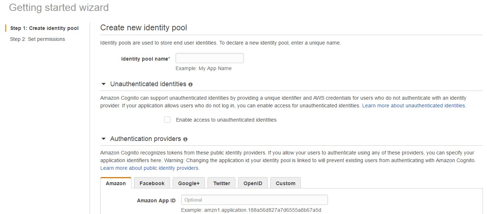
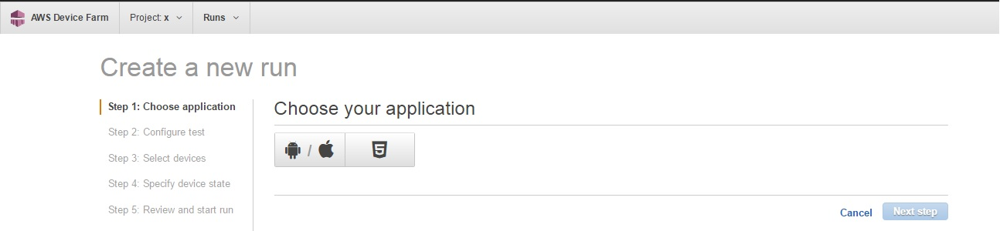
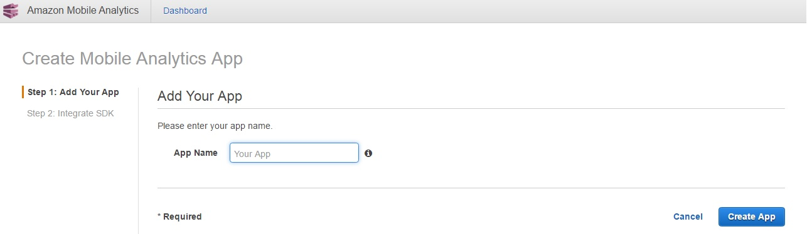
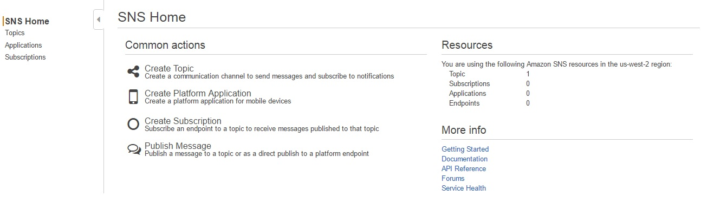
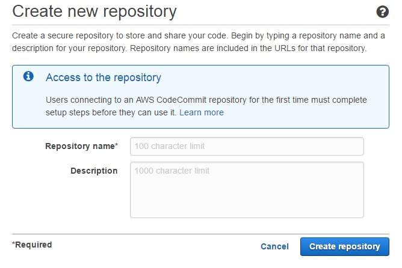
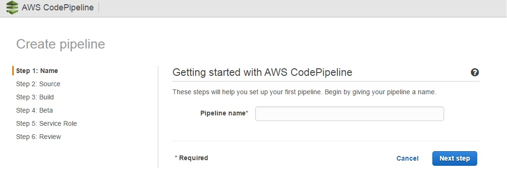
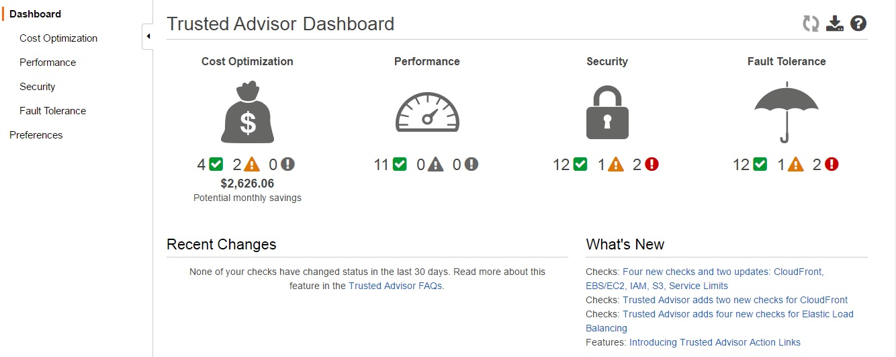
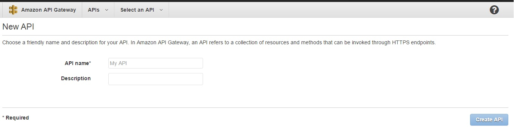

Amazon Web Services IoT
==

**AWS IoT (Amazon Web Services Internet of Things) ** is the cloud platform that help us to connect **IoT (Internet of Things)** devices, to the Amazon Cloud, faster, securely and also provides an elastic solution for the customer, but what is amazon web services?

Amazon Web Services (AWS) was created to expose the Amazon Cloud Services to every customer that need this service(s). The Services that AWS provides are:

* Amazon EC2 - Amazon Elastic Compute Cloud can help you to obtain and boot new service instances, you can create a new Virtual Machine in seconds scale up and down in resources instantly.

* Amazon S3 - Amazon Simple Storage Service is a service designed to store any amount of data, this includes different uses cases for example how often do you need to access your data ? Frequently, Standard or Infrequent ?
 

* Amazon DynamoDB offer a NoSQL Database, you can use this service to collect information in a consistent way and with millisecond latency.

 

* AWS IoT - AWS Internet of Things, This module will help us to connect our IoT devices with the AWS infrastructure and use the information that our devices send in any manner this means, we can process the data, stored the data, create a flow based on conditions that we see on the data , store the data and apply machine learning algorithms and big data analysis.

* Amazon EC2 Container Registry - On this module you can create Docker Containers an linked this container to a service using teh Amazon EC2 service.

* AWS Lambda, this service help us to execute our code without provisioning or managing servers, your code will be executed in the Lamda service, all the pipes behind will be transparent for you.

* Elastic Load Balancing, the service will help to the Amazon customers to distribute the traffic across multiple EC2 instances (Servers running a web application, for example)

* Amazon CloudFront will help us to distribute content to our end users via Web or using RTMP.

* Amazon Elastic Block Storage, Amazon EBS gives us the capability that provides persistent storage volumes that you can use with EC2, this storage is replicated to provide High Availability.

* Amazon RDS -Amazon Relational Database Service offer different engines for the most used relational databases like Amazon Aurora,SQL Server, Oracle, PostgreSQL, MySQL and MariaDB.

* Amazon ElastiCache offer a web service that scale an in memory cache in the cloud. ElastiCache supports two open-source in-memory caching engines Memcached or Redis

* Amazon Redshift is a fast, petabyte-scale data warehouse that makes it simple and cost-effective to analyze all your data using your existing business intelligence tools.

* AWS Data Pipeline helps you to move, integrate, and process data across AWS compute and storage resources, as well as your on-premises resources. AWS Data Pipeline supports integration of data and activities across multiple AWS regions.

* Amazon Elasticsearch Service provides a managed service that makes it easy to deploy, operate, and scale Amazon ES in the AWS cloud. Elasticsearch is a popular open-source search and analytics engine for use cases such as log analytics, real-time application monitoring, and click stream analytics.

* Amazon Cognito helps you securely store, manage, and sync identities and data across multiple devices, platforms, and applications.

* AWS Device Farm enables you to improve the quality of your Android, iOS, and Fire OS apps by quickly and securely testing them on hundreds of real smart phones, tablets, and other devices in the AWS cloud.

* Amazon Mobile Analytics is a service that lets you simply and cost effectively collect and analyze app usage data.

* Amazon SNS is a web service that enables applications, end-users, and devices to instantly send and receive notifications from the cloud.

* AWS CodeCommit, this service help us to create secure repositories for sharing your code in the cloud.

* AWS CodePipeline visualize and automate the different stages of your software release process, and watch your code.

* AWS Key Management Service 

* Amazon CloudWatch monitors your Amazon Web Services (AWS) resources and the applications you run on AWS in real-time. You can use CloudWatch to collect and track metrics, which are the variables you want to measure for your resources and applications. CloudWatch alarms send notifications or automatically make changes to the resources you are monitoring based on rules that you define.

* AWS Trusted Advisor Provision your resources following best practices to improve system performance and reliability, increase security, and look for opportunities to save money.

* Amazon API Gateway helps developers to create and manage APIs to back-end systems running on Amazon EC2, AWS Lambda, or any publicly addressable web service. With Amazon API Gateway, you can generate custom client SDKs for your APIs, to connect your back-end systems to mobile, web, and server applications or services.

* Amazon AppStream, this service help us to stream applications to desktop and mobile devices form the cloud.

* Amazon Elastic Transcoder
* Amazon SES
* Amazon SQS
* Amazon SWF