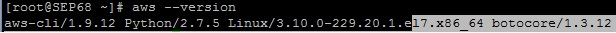
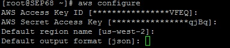
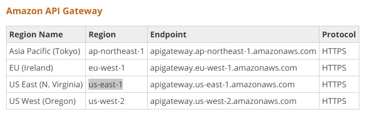
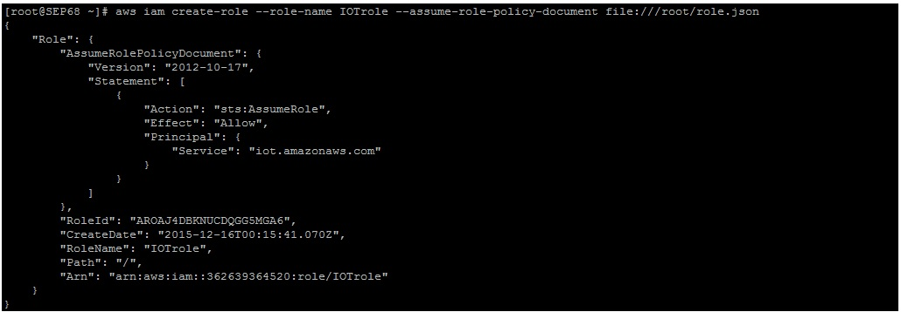
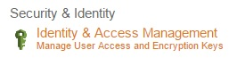
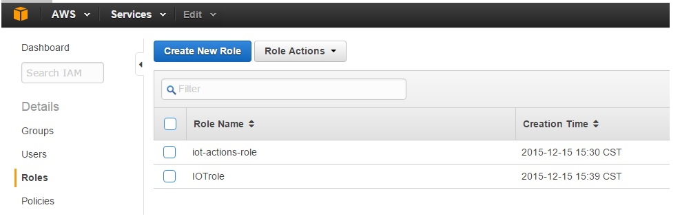
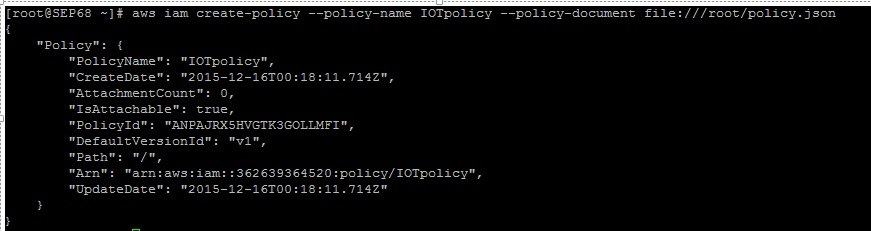
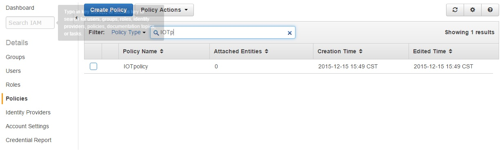
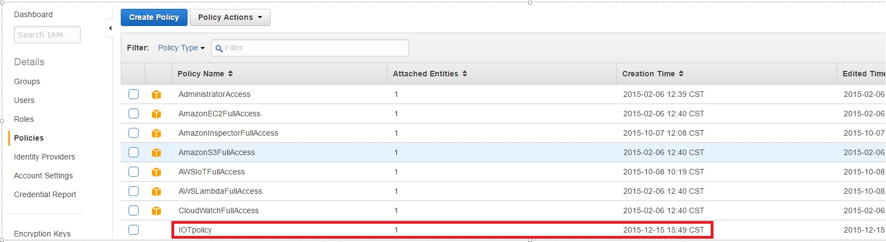
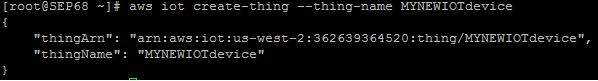

# Lesson 10 - Using the Amazon CLI

In our previous sessions (Lesson 3 to 9) we use the graphical interface to create and configure the IoT devices to report to the AWS infrastructure.
In this lesson we will install the AWS CLI (Client Line Interface to configure our IoT device on the AWS infrastructure)

First we need to install the AWS CLI folow this tutorial to install the software: 

* http://docs.aws.amazon.com/cli/latest/userguide/installing.html
 
After you complete the installation, just test it:

    $ aws help

You must see something like this:

Execute the command aws configure to set up our credentials

The credentials was created on the lesson 1.
The default amazon region must be selected from this table:

**Note:** In the example, I'm using US West (Oregon) us-west-2

---

The next step is grant to our CLI user the AWS IoT access.

Use the create-role command to create an IAM role:

    $ aws iam create-role --role-name IOTrole --assume-role-policy-document file:///root/role.json

Specify the following trust policy document, which grants AWS IoT permission to assume the role:
{
    "Version":"2012-10-17",
    "Statement":[{
        "Effect": "Allow",
        "Principal": {
            "Service": "iot.amazonaws.com"
        },
        "Action": "sts:AssumeRole"
    }]
}

 You will see this:
 
 
 
Note: The Amazon Resource Name (ARN) of the role in the command output.
In this example the ARN value its **"arn:aws:iam::362639364520:role/IOTrole"**

On the amazon console you can check the role on the IAM option:

 Under Roles, you will see the IOTrole that we create with the last command:
 
 
 
 Use the create-policy command to grant AWS IoT access to your AWS resources upon assuming the role:
 
    $ aws iam create-policy --policy-name IOTpolicy --policy-document file:///root/policy.json

The following is an example policy document that grants AWS IoT administrator access to DynamoDB:

    {
        "Version": "2012-10-17",
        "Statement": [{
            "Effect": "Allow",
            "Action": "dynamodb:*",
            "Resource": "*"
        }]
    }

You must see this:

Note: In this example the value of the ARN can be checked on the line:
    
    "Arn": "arn:aws:iam::362639364520:policy/IOTpolicy",

On the amazon console you can check the role on the IAM option 

Under Policies use the filter and type **IOTp**, you will see the policy that the code creates.

Use the attach-role-policy command to attach your policy to your role:

    $ aws iam attach-role-policy --role-name IOTrole --policy-arn  "arn:aws:iam::362639364520:policy/IOTpolicy"

Return to the console and check that the IOTpolicy have 1 attached entities

Now we can proceed and create via the CLI our first IoT on AWS, we just need to execute:

    aws iot create-thing --thing-name MYNEWIOTdevice
    
You will see this result:

 
**Note:** Check the ARN value of the our new IoT device this willbe used later:

**"thingArn": "arn:aws:iot:us-west-2:362639364520:thing/MYNEWIOTdevice",**
 
 
 
 
