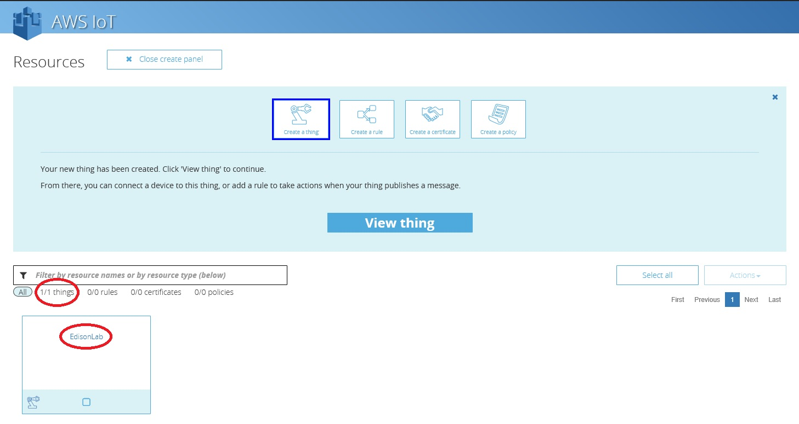

# Lesson 3: Create an IoT device

After you complete the Lesson 2, please return to the AWS Console using the **orange box icon**.

Now you will see the **AWS console** again...

Select the option called, **AWS IoT**.

You will see the Welcome page from the AWS IoT page, Click on the **Get Started** Button:

This is the wizard that we must follow to create an IoT Device on the AWS IoT Console.

Type the name of our IoT device and please, click on the **Create** Button 

You will see a new element (square) called EdisonLab on the Panel.

Please , continue with the Lesson 4 to create the certificates for this IoT device.