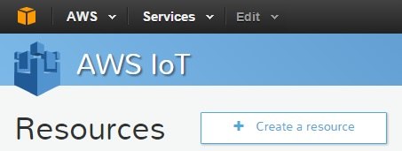
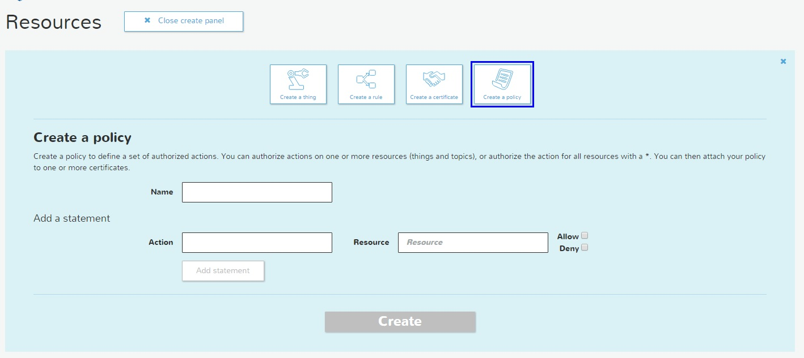
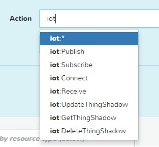
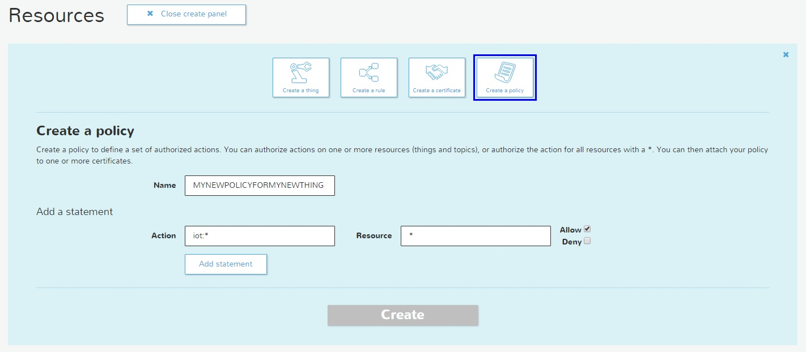
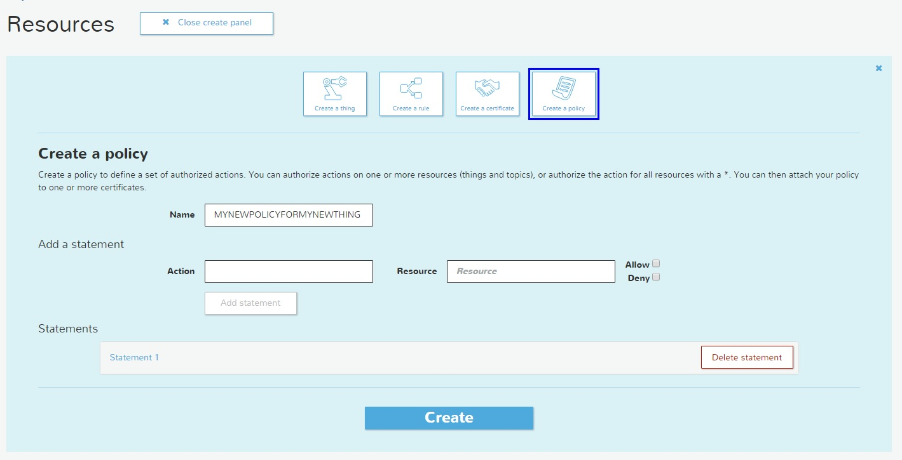

# Lesson 3A: Create a Policy for the IoT device

For the new release of the AWS IoT module you need to create the Policy, we will proceed to do this, first we need to click on the **Create resource** button:

Now select the Icon called **Create a  Policy** you will see this:

On the combo box Name, just introduce the name of the policy be descriptive.

On the action Name, select the action that you want to assign to your IoT device. the Following Actions can be configured:

* The iot:* grant all the privileges to you IoT device.
* The iot:Publish grant just the privilege to publish the message to you IoT device.
* The iot:Subscribe grant just the privilege to ?? the message to you IoT device.
* The iot:Connect grant just the privilege to ?? the message to you IoT device.
* The iot:Receive grant just the privilege to ?? the message to you IoT device.
* The iot:UpdateThingShadow grant just the privilege to ?? the message to you IoT device.
* The iot:GetThingShadow grant just the privilege to ?? the message to you IoT device.
* The iot:DeleteThingShadow grant just the privilege to ?? the message to you IoT device.

 
On the Resource you can type the resources that can use this policy using ARNs (Amazon Resource Names its a  unique identifier of the AWS resource) 

Select the combo box Allow, to allow the communication with the Rules Engine.

Now click on the Add Statement button

With this new capability you can create different permissions and assign to different IoT devices using the ARNs.

Now just click on the Create button and you will see your new policy ready.

