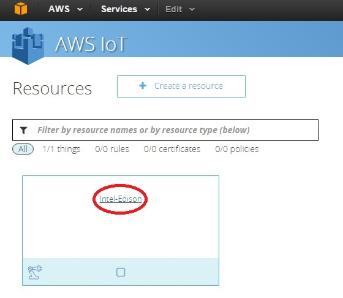
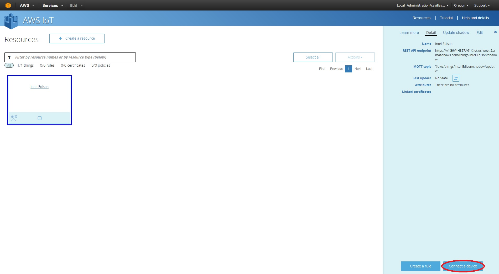
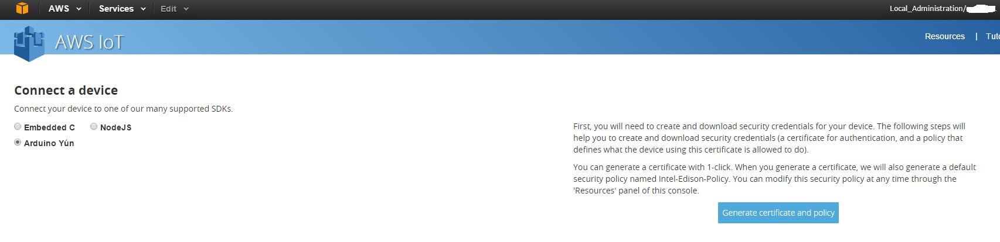
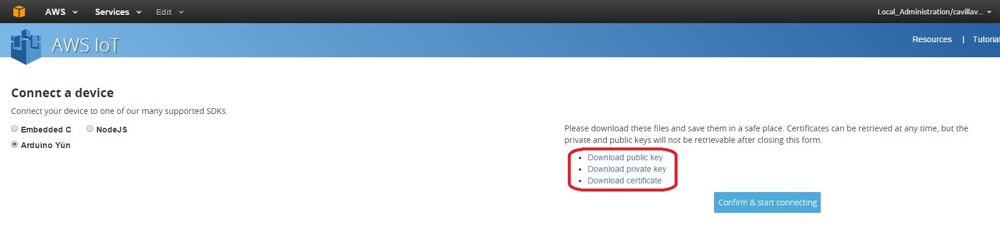
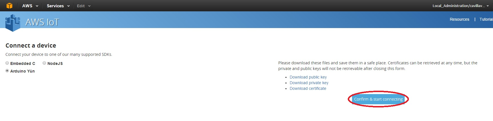

# Lesson 4: Create a Certificate

We must create the certificate to secure the communication between the IoT device and the amazon server(s) that will receive the information that our IoT device will create.

Click on the Intel-Edison name of the IoT device that we create in the last lesson.

On the left side of the screen you will see this:

A new panel called **Detail**, please click on the Connect a device button on the **lower left side of the screen** (see the red circle on the image).

Now the wizard will display you this options, select the Arduino Yun and click on the button generate certificate and policy.

The wizard will create the certificate to establish the connection with the amazon server and the public and private key. Please download and store it in a safe place we will sue it later to configure the Edison device.

After you confirm that you have the 3 files (one certificate, one public key and one private key, please click on the button Confirm and start connecting.

