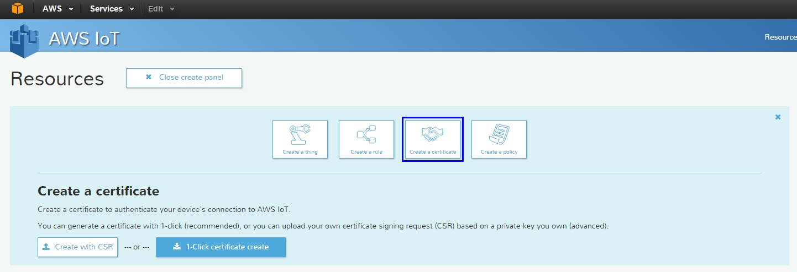
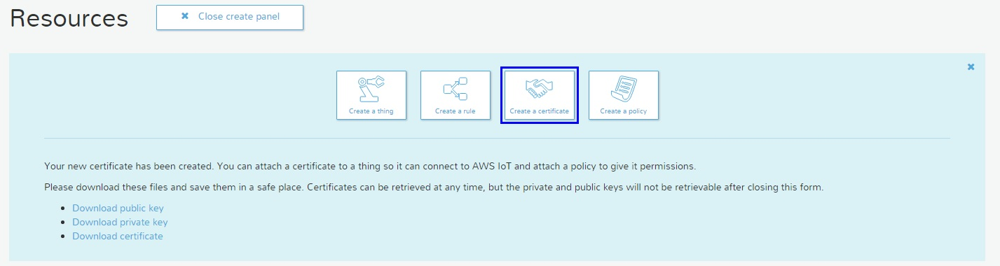
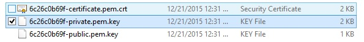
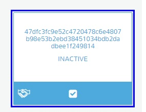
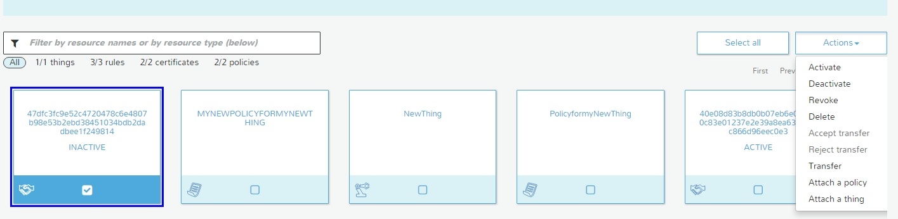
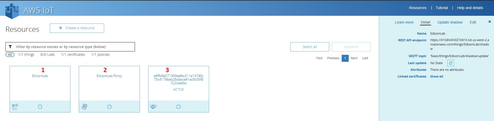

# Lesson 4: Create a Certificate

We must create the certificate to secure the communication between the IoT device and the amazon server(s) that will receive the information that our IoT device will create.

Click on the Resource Panel and select the option Create a certificate:

Just Click on the 1 Click certificate create button.
AWS will create the certificate to establish the connection with the amazon server and the public and private key. Please download and store it in a safe place we will use it later to configure the Edison device.

This is the example / test certificates that I download, please verify that you have 3 similar files.

After you confirm that you have the 3 files (one certificate, one public key and one private key, please close the Create Panel.

By default the certificate its INACTIVE, please select your certificate and active it.

* Select the Certificate

    

* Now go to the Actions button and Active it.

    

You must see the initial page but now we have 2 squares (the first-one is the IoT device, the second-one its the Policy of that device and the third-one, its the certificates of the device)

##**NOW its time to configure the Edison, please check the following tutorial to do this... LINK to the tutorial...**
 

