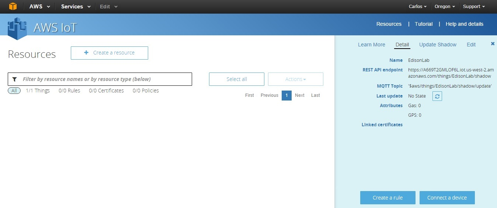

# Lesson 4: Create a Certificate

We must create the certificate to secure the communication between the IoT device and the amazon server(s) that will receive the information that our IoT device will create.

Click on the Intel-Edison name of the IoT device that we create in the last lesson.

On the left side of the screen you will see this:

A new panel called **Detail**, please click on the Connect a device button on the **lower left side of the screen** (see the red circle on the image).

