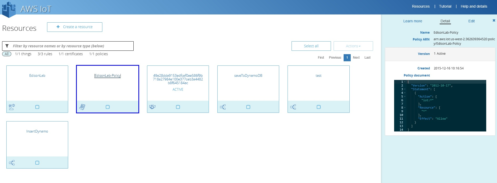
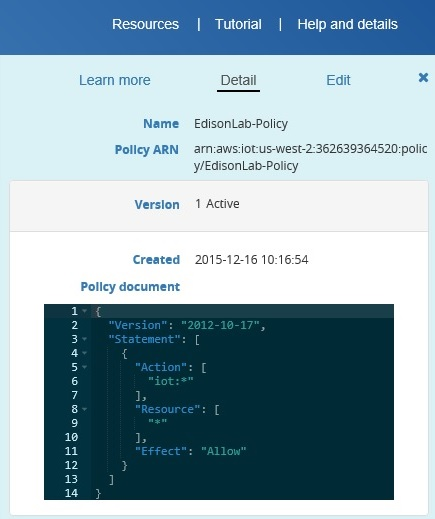

# Lesson 6: Review the Policy

On the lesson 4, the policy was created automatically when we request the certificate, right now we will just check that the policy is there and we will explain a little bit how the policies works o on AWS.

Select the Square called EdisonLab-Policy on the Detail page (right side of the screen) you will see this:

On the Detail page, you can see the different values of the policy:

The policy provide authorization to the IoT devices, with the policies you can allow or deny certain topics or devices.

In our case, on the picture we can see Policy Document this is the code that AWS create for this policy, the components of the EdisonLab-Policy are:

**Version** "2012-10-17"

**Effect** must be set to "Allow" or "Deny", in our case is the last line on the code and the value its "Allow"

**Action** must be set to "iot":**"operation-name"** where "operation-name" is one of the following:

* **"iot:Publish"** - MQTT publish.
* **"iot:Subscribe"** - MQTT subscribe.
* **"iot:UpdateThingShadow"** - Update a thing shadow.
* **"iot:GetThingShadow"** - Retrieve a thing shadow.
* **"iot:DeleteThingShadow** - Delete a thing shadow.

In our case we are using asterisk (*) to allow all the operations.

**Resource** must be set to one of the following:

* Client - arn:aws:iot:<region>:<accountId>:client/<clientId>
* Topic ARN - arn:aws:iot:<region>:<accountId>:topic/<topicName>
* Topic filter ARN - arn:aws:iot:<region>:<accountId>:topicfilter/<topicFilter>

In our case we are using asterisk (*) to allow all the resources.

You can read more about AWS policies here:
http://docs.aws.amazon.com/iot/latest/developerguide/authorization.html