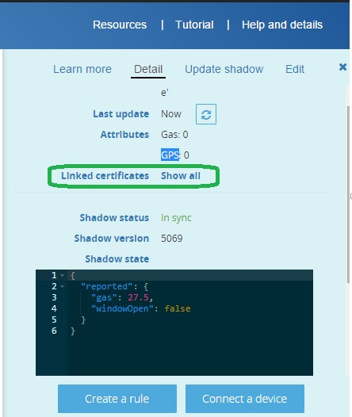

# Lesson 5: Testing the Comunication Edison to AWS infrastructure.

After you finished the configuration of your Edison device, please verify that you are seeing data on the AWS infrastructure.

Return to your Amazon account and select the AWS IoT icon, after that select the IoT that we called Edison Lab you must see this information on the Detail page (left side of the screen)

Note: If you are having issues please verify that you are using the information that is inside of the blue square in your code. The Name, rest API endpoint, MQQT topic needs to be the same.

Another important information are the certificates, that you need to use to establish the communication with the AWS infrastructure. You can check which certificates the Iot device is using just clicking on the **Show All** link that is in-front of the Linked certificates option. (See the green circle on the next image)

If you are having issues to communicate your device with the Amazon infrastructure please check this link http://docs.aws.amazon.com/iot/latest/developerguide/diagnosing-connectivity-issues.html, remember that the CA.pem certificate needs to be downloaded from here: https://www.symantec.com/content/en/us/enterprise/verisign/roots/VeriSign-Class%203-Public-Primary-Certification-Authority-G5.pem

The cert.pem and privateKey.pem are the certificates that you download on the Lesson 3.