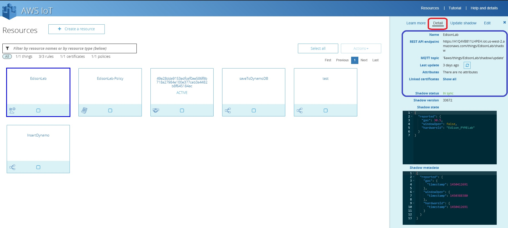

# Lesson 5: Testing the Comunication Edison to AWS infrastructure.

After you finished the configuration of your Edison device, please verify that you are seeing data on the AWS infrastructure.

Return to your Amazon account and select the AWS IoT icon, after that select the IoT that we called Edison Lab you must see this information on the Detail page (left side of the screen)

