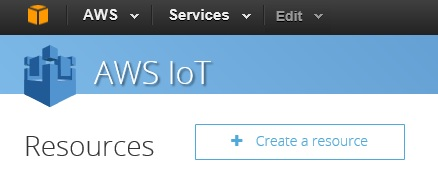
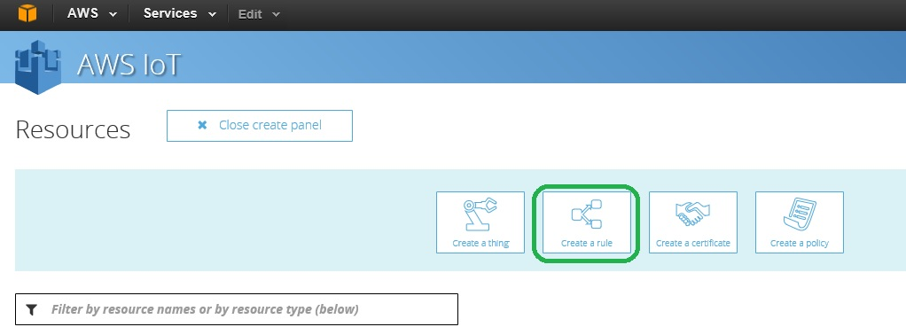
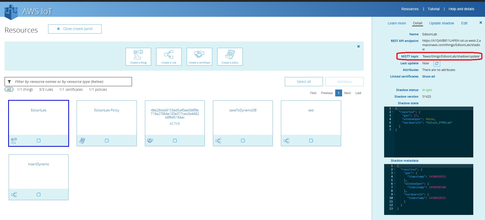
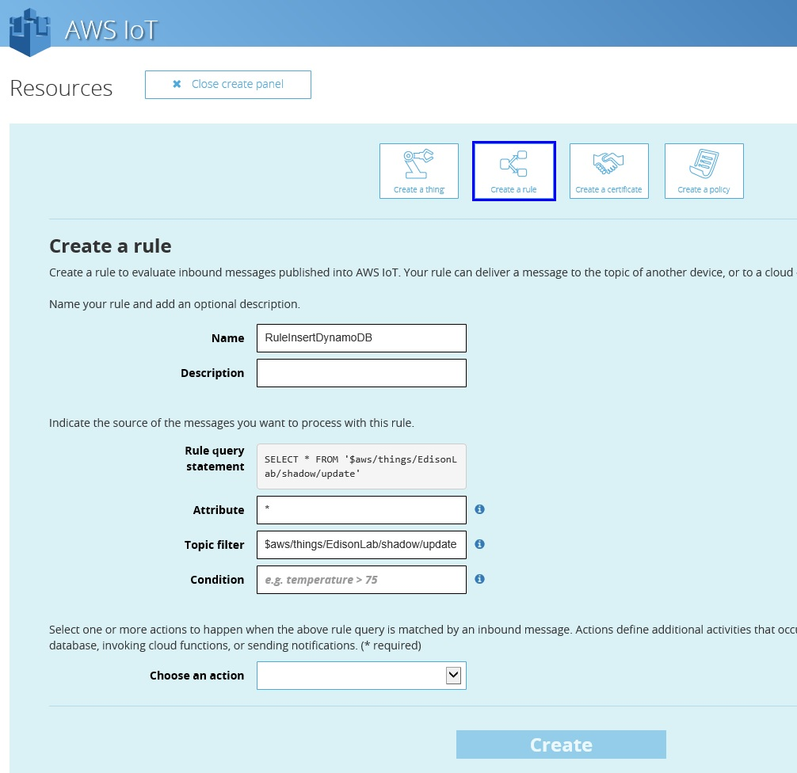
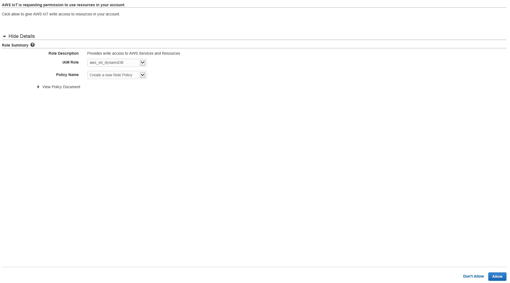
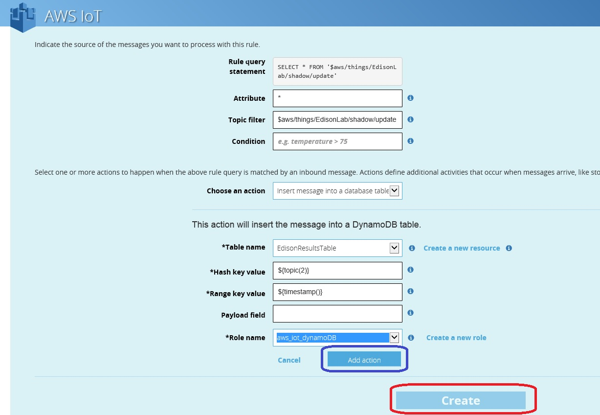

# Lesson 8: Create a Rule to Store our Data.

Return to the AWS IoT dashboard and click on the **Create a resource** button.

Select the option **Create a rule**

Now you just need to complete the following information:

* Name, its the Name of the rule, in our case we called RuleInsertDynamoDB
* Description, is optional you can type a description of the rule.
* Rule query statement cant be modified.
* Attribute, its the attribute that we can catch from the device in our case we will catch all the information we will use an asterisk (*) to indicate that we need all the information. 
* Topic Filter: We must use the topic filter that our Edison sensor is using in my case its: **$aws/things/EdisonLab/shadow/update**, this information can be extracted from the EdisonLab resource on the Details page under the MQTT topic.

* 

* Condition, for this test we will leave it, blank we will catch and store all the messages.

Now in the Choose and action filed select **Insert message into a database table (Dynamo DB)**
On the Table name field sleect the name of the table that we create on the Lesson 7, EdisonResultsTable

Hash key Value type ${topic(2)}

Range key value type ${timestamp()}

Payload field leave it blank we need all the payload to understand the information that we are sending from the Edison.

In the Role name click on the create a new role link, this will help you to create a role in IAM.

Just check the name that Amazon will assing to teh role and clik in the buton Allow, in this case the IAM Role is called aws_iot_dynamoDB

After you finish this task just select the new role that you created.

Now click on the Add Action button (blue square) and after click on the Create button (red square)

